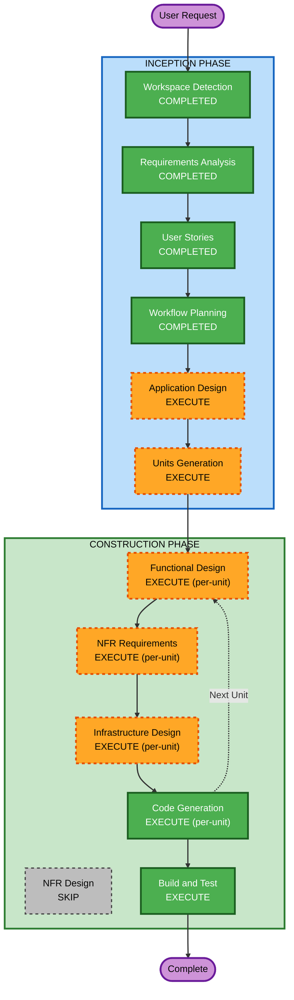

# Execution Plan - 테이블오더 서비스

## Detailed Analysis Summary

### Change Impact Assessment
- **User-facing changes**: Yes - 고객 주문 UI + 관리자 대시보드 전체 신규 구축
- **Structural changes**: Yes - 전체 시스템 아키텍처 신규 설계
- **Data model changes**: Yes - 매장, 테이블, 메뉴, 주문, 세션 데이터 모델 신규
- **API changes**: Yes - REST API 전체 신규 설계
- **NFR impact**: Yes - SSE 실시간 통신, 세션 관리, 인증

### Risk Assessment
- **Risk Level**: Medium
- **Rollback Complexity**: Easy (Greenfield - 롤백 불필요)
- **Testing Complexity**: Moderate (실시간 통신, 세션 관리 테스트 필요)

---

## Workflow Visualization



### Text Alternative
```
Phase 1: INCEPTION
  - Workspace Detection (COMPLETED)
  - Requirements Analysis (COMPLETED)
  - User Stories (COMPLETED)
  - Workflow Planning (COMPLETED)
  - Application Design (EXECUTE)
  - Units Generation (EXECUTE)

Phase 2: CONSTRUCTION (per-unit loop)
  - Functional Design (EXECUTE)
  - NFR Requirements (EXECUTE)
  - NFR Design (SKIP)
  - Infrastructure Design (EXECUTE)
  - Code Generation (EXECUTE)
  - Build and Test (EXECUTE)
```

---

## Phases to Execute

### INCEPTION PHASE
- [x] Workspace Detection - COMPLETED
- [x] Requirements Analysis - COMPLETED
- [x] User Stories - COMPLETED
- [x] Workflow Planning - COMPLETED
- [ ] Application Design - EXECUTE
  - **Rationale**: 신규 프로젝트로 컴포넌트 식별, 서비스 레이어 설계, 컴포넌트 간 의존성 정의 필요
- [ ] Units Generation - EXECUTE
  - **Rationale**: 백엔드/프론트엔드(고객용+관리자용) 다중 컴포넌트로 유닛 분해 필요

### CONSTRUCTION PHASE (per-unit)
- [ ] Functional Design - EXECUTE
  - **Rationale**: 데이터 모델(매장, 테이블, 메뉴, 주문, 세션), 비즈니스 로직(주문 생성, 세션 관리, 상태 변경) 상세 설계 필요
- [ ] NFR Requirements - EXECUTE
  - **Rationale**: SSE 실시간 통신, JWT 인증, 세션 관리, PBT 프레임워크 선정 등 기술 스택 결정 필요
- [ ] NFR Design - SKIP
  - **Rationale**: NFR 패턴이 단순 (SSE, JWT, bcrypt) - NFR Requirements에서 충분히 커버 가능
- [ ] Infrastructure Design - EXECUTE
  - **Rationale**: Docker Compose 기반 배포 아키텍처 설계 필요 (Spring Boot + React + SQLite 컨테이너 구성)
- [ ] Code Generation - EXECUTE (ALWAYS)
  - **Rationale**: 구현 계획 수립 및 코드 생성
- [ ] Build and Test - EXECUTE (ALWAYS)
  - **Rationale**: 빌드 및 테스트 지침 생성

---

## Success Criteria
- **Primary Goal**: 고객이 태블릿에서 메뉴를 보고 주문하며, 관리자가 실시간으로 주문을 모니터링하는 테이블오더 MVP 완성
- **Key Deliverables**:
  - Spring Boot REST API + SSE 서버
  - React TypeScript 고객용 웹 UI
  - React TypeScript 관리자용 대시보드
  - SQLite 데이터베이스
  - Docker Compose 배포 설정
  - Property-Based Testing (jqwik)
- **Quality Gates**:
  - 모든 API 엔드포인트 동작 확인
  - SSE 실시간 주문 알림 2초 이내
  - PBT 규칙 준수 (PBT-01 ~ PBT-10)
  - INVEST 기준 충족하는 사용자 스토리 커버리지
